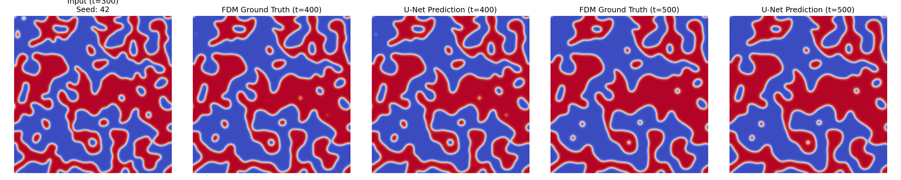

# Phase-Field AI Surrogate Solver

This repository explores hybrid numerical and machine learning approaches to solve the Allen-Cahn equation, a stiff parabolic partial differential equation (PDE) used to model phase separation and microstructural evolution.

## Project Overview

1. **Numerical Baseline (FDM):** Implemented a multi-core optimized Finite Difference Method (explicit Euler scheme) to generate highly accurate, physically consistent phase-coarsening data.
2. **ML Surrogate Model (U-Net):** Designed and trained a Convolutional Neural Network (U-Net) to act as an autoregressive surrogate solver. The model learns the transient phase-field dynamics, mapping the system state at $t$ to $t+\Delta t$.

## Results and Visualization
The U-Net was trained on frames generated from randomly seeded initial conditions. Below is the model's performance on a **completely unseen test seed**. The surrogate model successfully predicts the interfacial dynamics autoregressively without solving the underlying PDEs.

## Repository Structure
* `allen_cahn_fdm.py`: Base FDM solver for data generation and verification.
* `allen_cahn_unet.py`: Multi-core data pipeline, U-Net architecture, training loop, and autoregressive evaluation.
